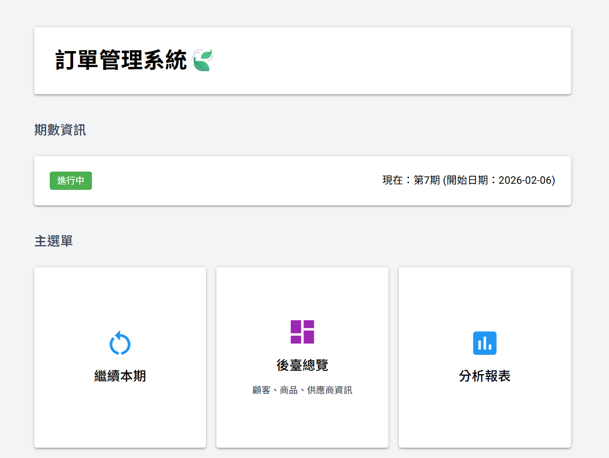
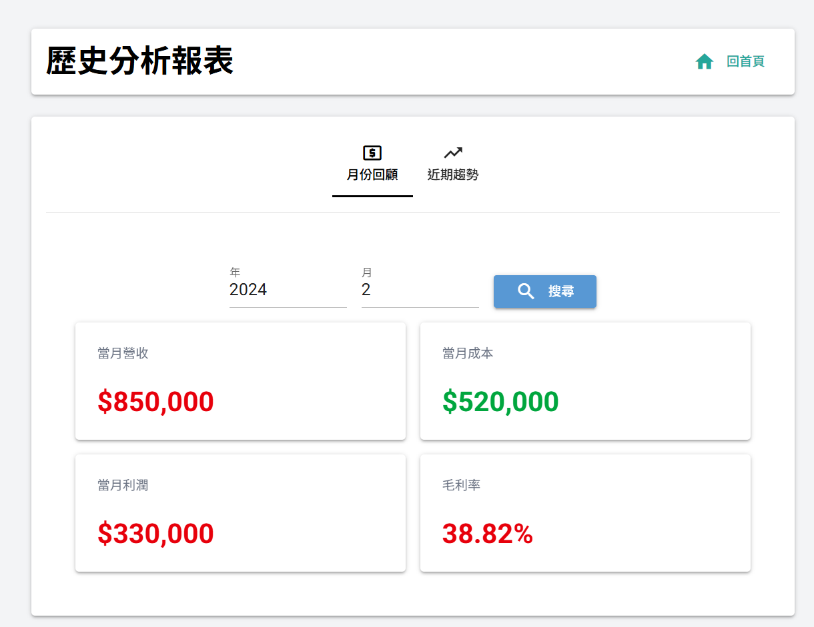
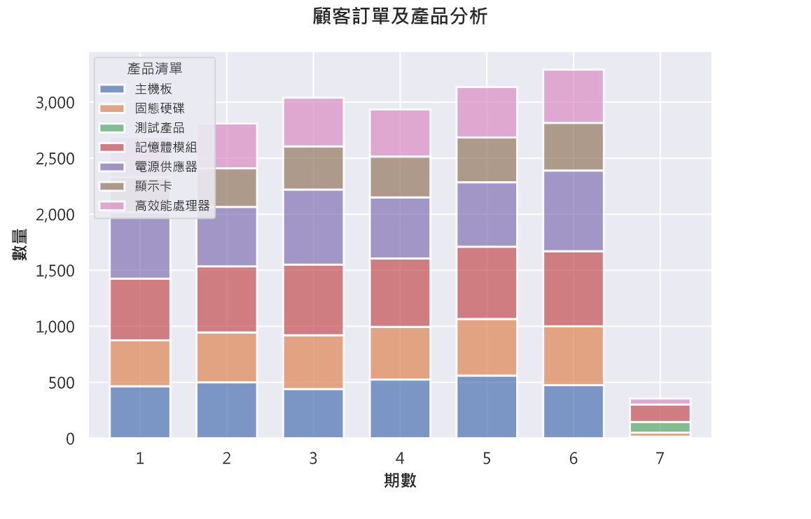

[Jump to English version](#business-cycle-management-system)

# 商業週期管理系統 (Business Cycle Management System)

這是一個full-stack訂單管理平台，旨在自動化管理訂單、定價策略以及跨週期的財務報告。本系統致力於透過自動化報表生成與週期性績效追蹤，將傳統的手動商業營運轉化為data-driven insight。

## 專案概述

本專案是一個學習性專案，靈感源自於家人的商業管理模式。本系統處理從訂單載入到財務分析的完整商業生命週期，專為以週期性時程運作的小型企業設計。透過提供以下功能，消除手動輸入excel的工作流程：

- **自動化財務報表**：包含營收、成本及利潤指標。
- **週期性數據建模**：用於進行同期比較分析（Period-over-period analysis）。
- **動態價格管理**：管理不同產品與客戶群體的定價。
- **供應鏈協調**：追蹤供應商訂單與進貨價格。
- **視覺化分析**：用於取得business insights。

## 技術棧

**後端與資料庫：**
- Python 3.11+
- SQLAlchemy ORM
- SQLite 

**前端：**
- NiceGUI (基於 Python 的web framework)

**數據分析與視覺化：**
- Matplotlib (趨勢分析圖表)
- Pandas (數據處理與清洗)
- SQL query (商業指標計算)

## 核心功能

### 自動化商業分析
- **每月績效報告**：自動按月彙整營收、成本、利潤及毛利率。
- **趨勢分析**：視覺化過去 20 個週期的利潤趨勢與訂單模式。
- **產品表現追蹤**：分析各產品的每週期銷售量。

### 週期化管理
- 開啟/結束一個商業週期，並自動記錄(logging)更新時間。
- 保存歷史數據，以便進行跨週期對比。
- 針對特定週期的定價與訂單管理。

### 財務計算
- 即時追蹤每個週期的營收與成本。
- 自動計算毛利率。
- 每位客戶折扣邏輯。
- 供應商成本彙整。

### 數據建模亮點
- **Normalized資料庫結構**：包含 7 個core entities (Customers, Products, Suppliers, Cycles, Orders, Prices, Settings)。
- **複合主鍵 (Composite Primary Keys)**：處理 Cycle-Customer-Product 之間的關聯。
- **關係映射**：使用 SQLAlchemy ORM 進行complex query。
- **時間追蹤**：使用 ISO format 紀錄時間，便於審計追蹤。

## 螢幕截圖

### 完整工作流程

*啟動週期 → 設定價格 → 記錄訂單 → 更新供應訂單 → 生成報告*

### 主頁面


### 財務報告


### 趨勢分析


## 安裝 & 設定

### 系統要求
```bash
Python 3.11+
uv (推薦) or pip
```

### 使用流程

**Clone the repository**
```bash
git clone <your-repo-url>
cd business-management-system
```

**安裝 dependencies**

Using `uv` (recommended):
```bash
uv sync
```

Or using `pip`:
```bash
pip install -r requirements.txt
```

**執行程式**

using `uv`:
```bash
uv run main.py
```

Or using `python` directly:
```bash
python main.py
```

## 使用範例

### 基本的商業週期流程

1. **設定階段** (一次性)
   - 新增客戶並設定其折扣
   - 將產品新增至庫存目錄
   - 新增採購供應商

2. **週期營運**
   - 開啟一個新的商業週期
   - 設定該週期的產品價格
   - 記錄客戶訂單
   - 記錄供應商進貨訂單與價格
   - 查看即時週期報表

3. **週期結算**
   - 系統計算總營收與成本
   - 自動計算利潤與毛利率
   - 存檔週期數據，供歷史分析使用

4. **數據分析**
   - 審視每月彙整數據
   - 分析跨多個週期的利潤趨勢
   - 比較產品在不同時間點的表現

## 專案結構
```
business-management-system/
├── main.py                          # Application entry point
├── database/
│   ├── models.py                    # SQLAlchemy ORM models
│   ├── db_operations_general.py     # CRUD operations for core entities
│   └── db_operations_cycle.py       # Cycle-specific queries & aggregations
├── logic/
│   └── logic.py                     # Business calculation logic
├── ui/
│   ├── components/                  
│       └── cycle_components.py      # Reusable UI components
│   └── pages/
│       ├── business_report.py       # Analytics dashboard & visualizations
│       ├── cycle_customer.py        # Customer order management
│       ├── cycle_main_page.py       # Cycle operations dashboard
│       ├── cycle_product.py         # Product pricing interface
│       ├── cycle_report.py          # Current cycle reporting
│       ├── cycle_router.py          # Routing for cycle pages
│       ├── cycle_supply.py          # Supplier order management
│       └── overview.py              # Master data management (CRUD)
└── utils/
    ├── helpers.py                   # Input validation utilities
    └── plotting_helpers.py          # Matplotlib chart generation
```

## 分析功能深入探討

### 1. 營收與成本分析
- **指標計算**：彙整所有「客戶訂單 × (產品價格 - 客戶折扣)」得出營收。
- **成本追蹤**：加總「供應商訂單 × 採購價格」。
- **利潤率**：計算公式為 `(營收 - 成本) / 營收 * 100`。

### 2. 趨勢視覺化
- **各週期利潤**：折線圖顯示過去 20 個週期的利潤軌跡。
- **訂單量分析**：stacked bar chart顯示各產品的需求模式。

### 3. 數據品質考量
- 針對名稱、價格及訂單數量進行輸入驗證。
- 對客戶、產品及供應商名稱設定 Unique constraints。
- 透過 Foreign key 確保參照完整性。
- 追蹤訂單及更新時間。

## 專案收穫

### 技術技能
- **資料庫設計**：實作符合 1NF-3NF 規範的正規化架構，以減少數據冗餘。
- **數據聚合**：應用 SQL Window functions 處理複雜的商業指標。
- **時序分析**：構建便於查詢與視覺化的數據結構。
- **Error handling與input validation**:使用 try/except block和自訂義validation functions以確保資料正確並處理使用者輸入錯誤。

### 商業敏銳度
- **週期建模**：設計出能反映真實商業運作模式的系統。
- **定價策略**：實作彈性的各週期定價機制，以因應市場波動。
- **關鍵績效指標 (KPI) 選擇**：選取能驅動商業決策的指標（如毛利率、利潤趨勢）。
- **數據完整性**：透過 foreign key constraints 確保 consistency。

### 問題解決
- **挑戰**：有效率的處理跨週期的浮動價格。
  - **解決方案**：建立 `ProductPrice` 表，並將 `cycle_id` 作為 composite primary key 的一部分。
- **挑戰**：跨多週期高效查詢訂單以進行趨勢分析。
  - **解決方案**：為 `cycle_id` 建立索引，並使用 JOIN 與 aggregate 運算。
- **挑戰**：防止在設定價格前就產生訂單。
  - **解決方案**：在訂單創建前進行驗證邏輯，檢查 `ProductPrice` 是否已存在。

## 貢獻與建議

這是一個學習性質的專案，非常歡迎任何建議！

---

# Business Cycle Management System

A full-stack business analytics platform that automates order management, pricing strategies, and financial reporting across business cycles. Built to transform manual business operations into data-driven insights through automated report generation and cycle-based performance tracking.

## Project Overview

This is a learning project inspired by how my family manages their business. This system manages the complete business lifecycle from order intake to financial analysis, designed for small businesses operating on cyclical schedules. It eliminates manual spreadsheet workflows by providing:

- **Automated financial reporting** with revenue, cost, and profit metrics
- **Cycle-based data modeling** for period-over-period analysis
- **Dynamic pricing management** across products and customer segments
- **Supply chain coordination** tracking supplier orders and pricing
- **Visual analytics** for trend identification and business insights

## Tech Stack

**Backend & Database:**
- Python 3.11+
- SQLAlchemy ORM for database management
- SQLite for relational data storage

**Frontend:**
- NiceGUI (Python-based web framework)

**Data Analysis & Visualization:**
- Matplotlib for trend analysis charts
- Pandas for data wrangling
- SQL aggregations for business metrics

## Key Features

### Automated Business Analytics
- **Monthly Performance Reports**: Automatically aggregates revenue, costs, profit, and gross margin by month
- **Trend Analysis**: Visualizes profit trends and order patterns over the last 20 cycles
- **Product Performance Tracking**: Analyzes sales volume by product across cycles

### Cycle-Based Management
- Start/end business cycles with automatic timestamp tracking
- Historical data preservation for period-over-period comparisons
- Cycle-specific pricing and order management

### Financial Calculations
- Real-time revenue and cost tracking per cycle
- Automated profit margin calculations
- Customer discount application logic
- Supplier cost aggregation

### Data Modeling Highlights
- **Normalized database schema** with 7 core entities (Customers, Products, Suppliers, Cycles, Orders, Prices, Settings)
- **Composite primary keys** for cycle-customer-product relationships
- **Relationship mapping** using SQLAlchemy ORM for complex queries
- **Temporal tracking** with ISO timestamp storage for audit trails


## Screenshots

### Complete Workflow

*Start cycle → Set prices → Record orders → Update supply order -> Generate report*

### Main Page


### Financial Reports


### Trend Analysis


## Installation & Setup

### Prerequisites
```bash
Python 3.11+
uv (recommended) or pip
```

### Steps

**Clone the repository**
```bash
git clone <your-repo-url>
cd business-management-system
```

**Install dependencies**

Using `uv` (recommended):
```bash
uv sync
```

Or using `pip`:
```bash
pip install -r requirements.txt
```

**Run the application**

Using `uv`:
```bash
uv run main.py
```

Or using `python` directly:
```bash
python main.py
```

**Access the interface**
Open your browser to `http://localhost:8080`
## Usage Example

### Typical Business Cycle Workflow

1. **Setup Phase** (One-time)
   - Add customers with discount rates
   - Add products to inventory catalog
   - Add suppliers for procurement

2. **Cycle Operations**
   - Start a new business cycle
   - Set product prices for the cycle
   - Record customer orders
   - Place supplier orders with pricing
   - View real-time cycle report

3. **Cycle Completion**
   - System calculates total revenue and costs
   - Automatically computes profit and margins
   - Archives cycle data for historical analysis

4. **Analysis**
   - Review monthly aggregated figures
   - Analyze profit trends across multiple cycles
   - Compare product performance over time

## Project Structure

```
business-management-system/
├── main.py                          # Application entry point
├── database/
│   ├── models.py                    # SQLAlchemy ORM models
│   ├── db_operations_general.py     # CRUD operations for core entities
│   └── db_operations_cycle.py       # Cycle-specific queries & aggregations
├── logic/
│   └── logic.py                     # Business calculation logic
├── ui/
│   ├── components/                  
│       └── cycle_components.py      # Reusable UI components
│   └── pages/
│       ├── business_report.py       # Analytics dashboard & visualizations
│       ├── cycle_customer.py        # Customer order management
│       ├── cycle_main_page.py       # Cycle operations dashboard
│       ├── cycle_product.py         # Product pricing interface
│       ├── cycle_report.py          # Current cycle reporting
│       ├── cycle_router.py          # Routing for cycle pages
│       ├── cycle_supply.py          # Supplier order management
│       └── overview.py              # Master data management (CRUD)
└── utils/
    ├── helpers.py                   # Input validation utilities
    └── plotting_helpers.py          # Matplotlib chart generation
```

## Analytical Features Deep Dive

### 1. Revenue & Cost Analysis
- **Metric Calculation**: Aggregates all customer orders × (product prices - customer discount) for revenue
- **Cost Tracking**: Sums supplier orders × purchase prices
- **Profit Margin**: Computes `(revenue - cost) / revenue * 100`

### 2. Trend Visualization
- **Profit by Cycle**: Line chart showing profit trajectory over 20 cycles
- **Order Volume Analysis**: Stacked bar charts showing product demand patterns

### 3. Data Quality Considerations
- Input validation for names, prices and order quantities
- Unique constraints on customer/product/supplier names
- Foreign key relationships ensure referential integrity
- Timestamp tracking for order creation and updates

## What I Learned

### Technical Skills
- **Database Design**: Implemented a normalized schema with 1NF-3NF compliance to minimize data redundancy
- **Data Aggregation**: Applied SQL window functions and grouping for complex business metrics
- **Time-Series Analysis**: Structured data for temporal queries and trend visualization
- **Error Handling & Input Validation**: Used try/except blocks and custom validators to ensure data integrity and handle user input errors

### Business Acumen
- **Cycle-Based Modeling**: Designed a system that mirrors real business operational patterns
- **Pricing Strategy**: Implemented flexible per-cycle pricing to reflect market conditions
- **KPI Selection**: Chose metrics (gross margin, profit trends) that drive business decisions
- **Data Integrity**: Ensured order-price consistency through foreign key validation

### Problem Solving
- **Challenge**: Handling variable pricing across cycles without data duplication
  - **Solution**: Created a ProductPrice table with cycle_id as part of the composite key
- **Challenge**: Efficiently querying orders across multiple cycles for trend analysis
  - **Solution**: Indexed cycle_id and used strategic JOINs with aggregations
- **Challenge**: Preventing orders before prices are set
  - **Solution**: Implemented validation logic checking ProductPrice existence before order creation


## Contributing

This is a learning project, but suggestions are welcome! 

---