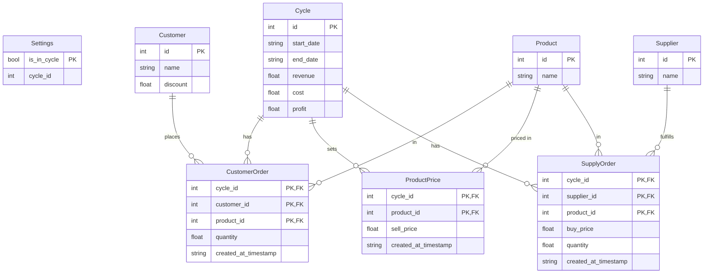

# Database ER Diagram

```mermaid
erDiagram
  Settings {
    bool is_in_cycle PK
    int cycle_id
  }
  Customer {
    int id PK
    string name
    float discount
  }
  Cycle {
    int id PK
    string start_date
    string end_date
    float revenue
    float cost
    float profit
  }
  Product {
    int id PK
    string name
  }
  Supplier {
    int id PK
    string name
  }
  CustomerOrder {
    int cycle_id PK,FK
    int customer_id PK,FK
    int product_id PK,FK
    float quantity
    string created_at_timestamp
  }
  ProductPrice {
    int cycle_id PK,FK
    int product_id PK,FK
    float sell_price
    string created_at_timestamp
  }
  SupplyOrder {
    int cycle_id PK,FK
    int supplier_id PK,FK
    int product_id PK,FK
    float buy_price
    float quantity
    string created_at_timestamp
  }

  Cycle ||--o{ CustomerOrder : "has"
  Customer ||--o{ CustomerOrder : "places"
  Product ||--o{ CustomerOrder : "in"
  Cycle ||--o{ ProductPrice : "sets"
  Product ||--o{ ProductPrice : "priced in"
  Cycle ||--o{ SupplyOrder : "has"
  Supplier ||--o{ SupplyOrder : "fulfills"
  Product ||--o{ SupplyOrder : "in"
```
